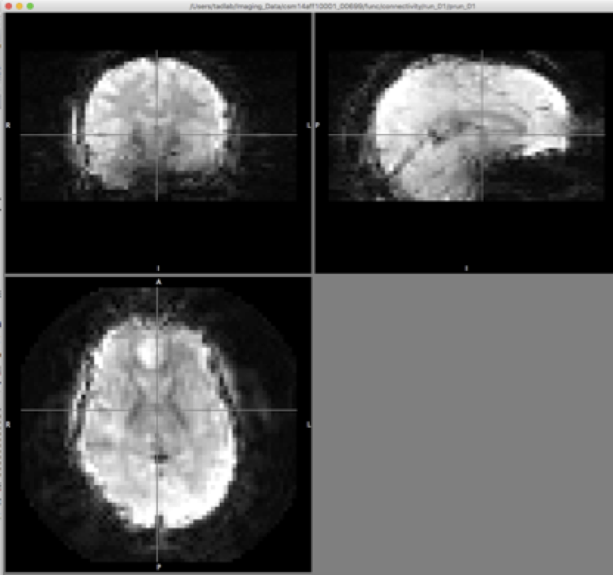

# Resting State Quality Control Checks
## Artifact Checking

1. Open Resting State Tracking Log: Desktop&gt;Resting State&gt;Resting State
Tracking Log

    a. Select Quality assurance tab

1. Open Fslview: Applications Fslview
1. Open the next id for artifact checking (see Tracking log) in fslview

   File -> open -> tadlab -> Imaging_Data
   -> [select id listed in tracking log]
   -> func -> connectivity -> run_01 -> prun_01.nii

   Then click the Open button.

   

1. Put the crosshair for fslview approximately on the anterior commissure of the sagittal view (top right)
   and vertically aligned with the longitudinal fissure in the horizontal and coronal views.

   

1. Check each volume from 0-234 for artifacts that impact 1/4th of the brain or more. * Do not move the
   cross hairs between volumes (this is not DTI artifact checking, functional artifacts should be large
   and obvious)
